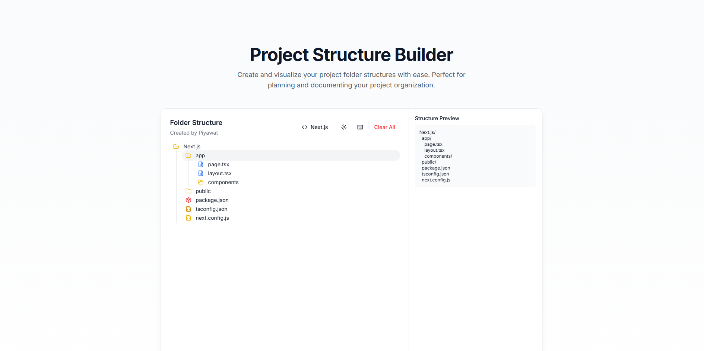

# 📁 Folder Structure Generator

A modern, interactive web application for creating and visualizing project folder structures. Built with Next.js and Tailwind CSS.



## ✨ Features

- 🌳 Visual folder structure creation and management
- 🎯 Drag-and-drop interface
- ⌨️ Keyboard shortcuts for quick actions
- 📋 Copy, cut, paste, and delete operations
- 📤 Export structures as JSON or tree format
- 📥 Import existing structures
- 🌓 Light/Dark mode support
- 💾 Auto-save functionality
- 🔄 Real-time structure preview
- 🎁 Framework-specific templates
- 🔧 Automatic project scaffolding
- 📱 Responsive design with horizontal scrolling tabs

## 🎁 Supported Frameworks

Generate instant project structures for popular frameworks:

- Next.js
- React
- Vue
- Angular
- Svelte
- Nuxt
- Remix
- Astro

Each framework template includes:
- Standard project layout
- Essential configuration files
- Common directories (components, pages, etc.)
- Framework-specific files and folders

## ⚡ Keyboard Shortcuts

- `⌘/Ctrl + C` - Copy selected item
- `⌘/Ctrl + X` - Cut selected item
- `⌘/Ctrl + V` - Paste into selected folder
- `Delete` - Delete selected item

## 🚀 Getting Started

### Prerequisites

- Node.js 16.x or later
- npm or yarn

### Installation

1. Clone the repository:
```bash
git clone https://github.com/TiwKill/FolderStructureGenerator.git
cd FolderStructureGenerator/app/
```

2. Install dependencies:
```bash
npm install
# or
yarn install
```

3. Run the development server:
```bash
npm run dev
# or
yarn dev
```

4. Open [http://localhost:3000](http://localhost:3000) in your browser.

## 🛠️ Built With

- [Next.js](https://nextjs.org/) - React framework
- [Tailwind CSS](https://tailwindcss.com/) - CSS framework
- [shadcn/ui](https://ui.shadcn.com/) - UI components
- [Lucide Icons](https://lucide.dev/) - Icons
- [Sonner](https://sonner.emilkowal.ski/) - Toast notifications

## 📝 Usage

1. **Framework Selection:**
   - Click the framework selector in the toolbar
   - Choose your desired framework
   - The appropriate project structure will be generated automatically

2. **Creating Items:**
   - Click the "+" button to create a new folder or file
   - Right-click to access the context menu

3. **Managing Items:**
   - Select items by clicking
   - Use keyboard shortcuts for quick actions
   - Drag and drop to reorganize

4. **Exporting:**
   - Click the export button on any folder
   - Choose between JSON or tree structure format

5. **Importing:**
   - Click the import button
   - Select a JSON file with your structure

6. **Starting Fresh:**
   - Click "Clear All" to reset the structure
   - Select a new framework to start with a different template

## 💡 Contributing

Contributions are welcome! Please feel free to submit a Pull Request.

1. Fork the project
2. Create your feature branch (`git checkout -b feature/AmazingFeature`)
3. Commit your changes (`git commit -m 'Add some AmazingFeature'`)
4. Push to the branch (`git push origin feature/AmazingFeature`)
5. Open a Pull Request

## 📄 License

This project is licensed under the MIT License - see the [LICENSE](LICENSE) file for details.

## 👏 Acknowledgments

- [shadcn/ui](https://ui.shadcn.com/) for the beautiful UI components
- [Lucide](https://lucide.dev/) for the icons
- All contributors and users of this project
